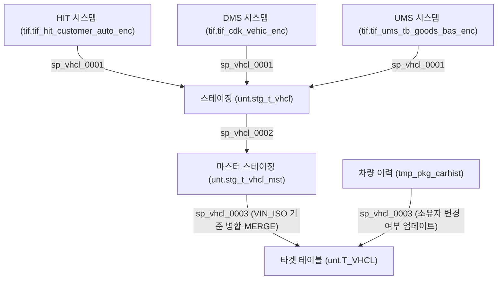

# T_VHCL 데이터 흐름 분석

## 개요
`T_VHCL` 테이블은 `PKG_UNT_0030` 패키지가 주관하는 다단계 ETL 프로세스를 통해 데이터가 적재됩니다. 이 프로세스는 세 가지 주요 소스 시스템인 HIT, DMS, UMS에서 차량 데이터를 수집하고 통합합니다.

## 데이터 흐름도

## 상세 프로세스

### 1. 데이터 수집 및 집계 (`sp_vhcl_0001`)
이 프로시저는 분산된 소스 시스템의 데이터를 통합 스테이징 테이블인 `unt.stg_t_vhcl`로 수집합니다.

- **타겟**: `unt.stg_t_vhcl` (Truncate & Insert)
- **소스**:

  1.  **HIT**: `tif.tif_hit_customer_auto_enc` (`t_vhcl_yr`, `t_vhcl_model` 등과 조인)
  2.  **DMS**: `tif.tif_cdk_vehic_enc` (`fleetno` 길이가 17, 18인 데이터만 필터링)
  3.  **UMS**: `tif.tif_ums_tb_goods_bas_enc` (`t_vhcl_model`과 조인)

### 2. 마스터 스테이징 적재 (`sp_vhcl_0002`)
수집된 데이터를 정제하여 마스터 스테이징 테이블 `unt.stg_t_vhcl_mst`로 로드합니다. 이 과정에서 중복 제거 및 우선순위 처리가 수행됩니다.

- **타겟**: `unt.stg_t_vhcl_mst` (Truncate & Insert/Merge)
- **로직**:

  1.  **초기화**: `stg_t_vhcl_mst` 테이블 Truncate.
  2.  **UMS 로드**: UMS 데이터를 `stg_t_vhcl`에서 조회하여 기본 데이터로 입력(Insert).
  3.  **HIT 병합**: HIT 데이터를 `stg_t_vhcl`에서 조회하여 병합(Merge).
    - *매칭 키*: `VIN_ISO`
    - *업데이트*: HIT 데이터가 존재하면 필드 업데이트 (`DECODE`를 사용하여 NULL이 아닌 값 우선 적용).
    - *입력*: 매칭되는 데이터가 없으면 신규 입력.
  4.  **DMS 병합**: DMS 데이터를 `stg_t_vhcl`에서 조회하여 병합(Merge).
    - *매칭 키*: `VIN_ISO`
    - *업데이트 logic*: DMS 데이터가 존재하면 필드 업데이트 (`DECODE` 사용).
    - *입력*: 매칭되는 데이터가 없으면 신규 입력.

### 3. 최종 타겟 적재 (`sp_vhcl_0003`)
최종적으로 `T_VHCL` 테이블을 업데이트합니다.

- **타겟**: `unt.T_VHCL`
- **소스**: `unt.stg_t_vhcl_mst`
- **로직**:

  - **MERGE**: `stg_t_vhcl_mst` 데이터를 `VIN_ISO` 기준으로 `T_VHCL`에 병합합니다.
  - **UPDATE**: 기존 차량 정보를 최신 상태로 갱신합니다.
  - **INSERT**: 신규 차량 정보를 생성합니다.
  - **소유자 변경 업데이트**: `tif.tif_ums_tb_est_carhistory_bas_enc`에서 파생된 임시 테이블 `tmp_pkg_carhist`를 사용하여 `OWNER_CHNG_YN`(소유자 변경 여부) 및 `OWNER_CHNG_DATE`를 업데이트합니다.

## 주요 소스 테이블
| 시스템 | 테이블 명 | 설명 |
| :--- | :--- | :--- |
| **HIT** | `tif.tif_hit_customer_auto_enc` | HIT 시스템의 고객 차량 데이터 |
| **DMS** | `tif.tif_cdk_vehic_enc` | CDK (DMS) 시스템의 차량 데이터 |
| **UMS** | `tif.tif_ums_tb_goods_bas_enc` | UMS 시스템의 상품/차량 기본 데이터 |
| **UMS** | `tif.tif_ums_tb_est_carhistory_bas_enc` | 소유자 변경 추적을 위한 차량 이력 데이터 |

## 스크립트 위치 정보
- **패키지**: `PKG_UNT_0030`
- **파일**: `c:/Dev_Work/HSMC/DW/DWP_20251125/UNT/PKG_UNT_0030.sql`
- **프로시저**:
    - `sp_vhcl_0001`: 라인 4634 - 4909
    - `sp_vhcl_0002`: 라인 4912 - 5400+
    - `sp_vhcl_0003`: 라인 5406+
